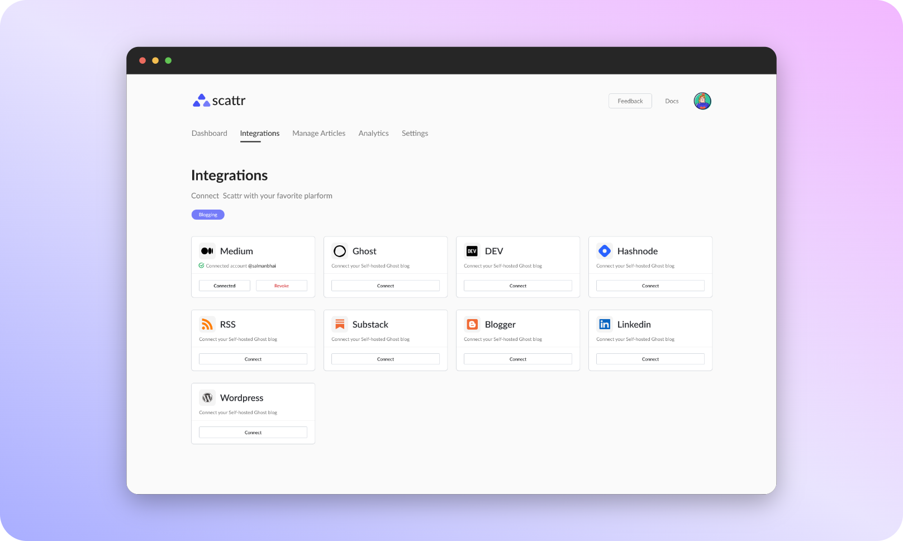
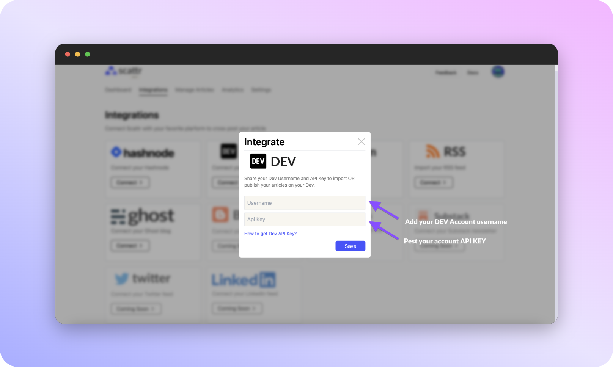
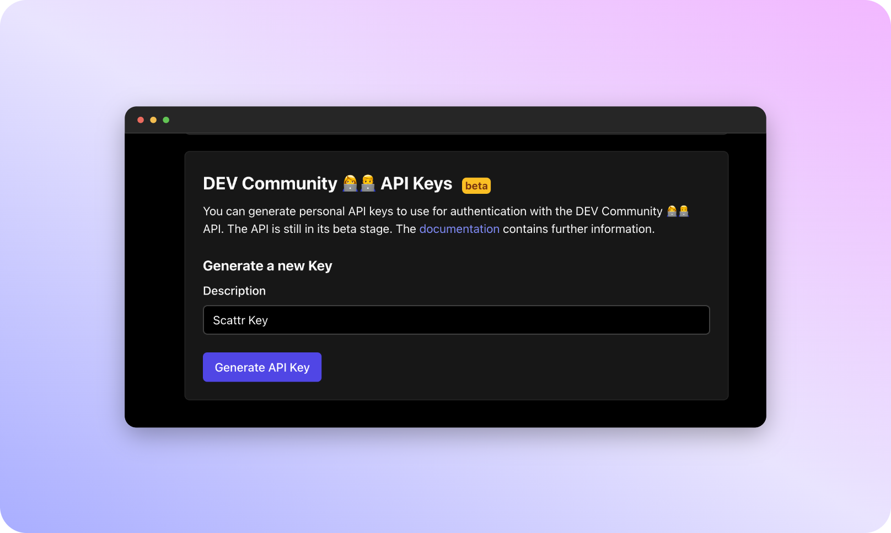

# DEV

First Integration on Scattr?
We are so excited to see you get started! 🥳

To add DEV.to on your account, 
Click on Integration Tab

Simply find DEV from the list of cards, and click on it's 'Connect' button.

A modal will pop-up asking your username and API Key - we only need read rights to fetch your articles from the platform.
(and no need to worry we respect privacy ❤️, check our [privacy policy](https://public.scattr.io/Legal-information/Scattr__Privacy_Policy.pdf).

Not Sure how to get API key?
Click on "How to get API key?" for further steps on the same.

Too lazy to read?
TLDR;

- Simply go to your [Dev Profile Page](https://dev.to/settings), 

- Go to [Extensions](https://dev.to/settings/extensions) > API keys (last section on page) 
- Add a tag (Eg: "Scattr") and click on Generate API key
- Copy the generated code (scroll to end of page again!) > Paste on scattr integration modal.

And that's all it takes, done! 🎊 You have your DEV profile is connected! ❤️

If this is your first Integration on Scattr, You can find a button on main page (bottom center) to connect your Scattr Account with other blogging platforms.

 
    