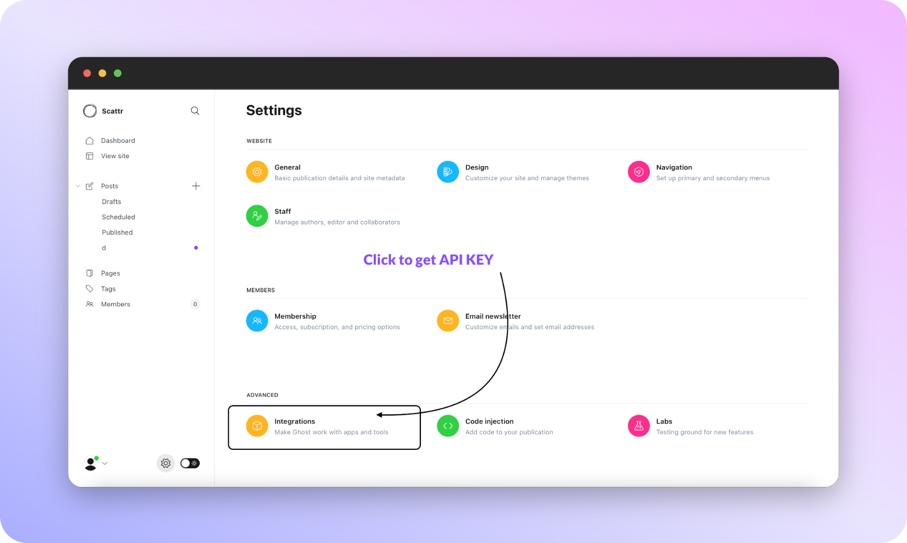
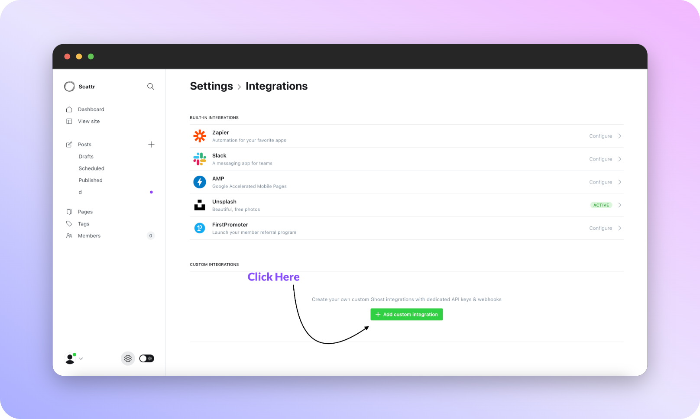
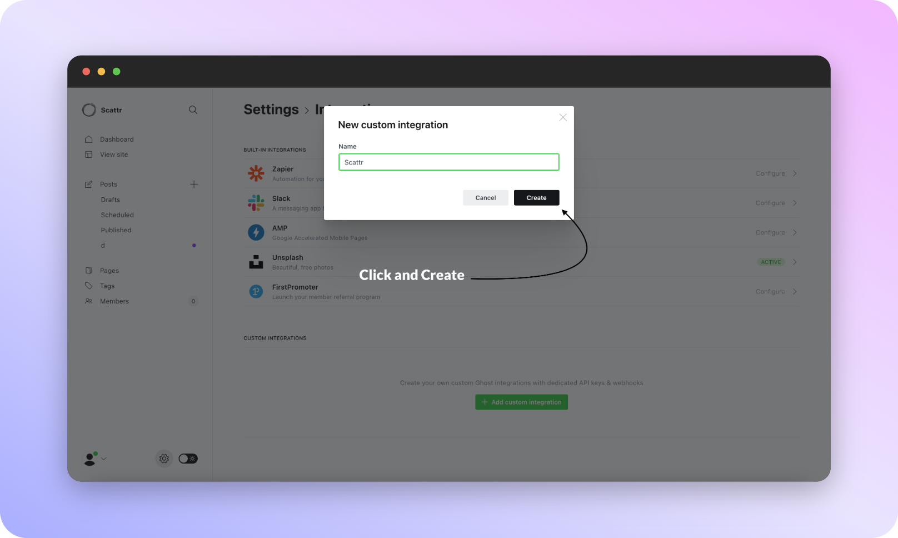
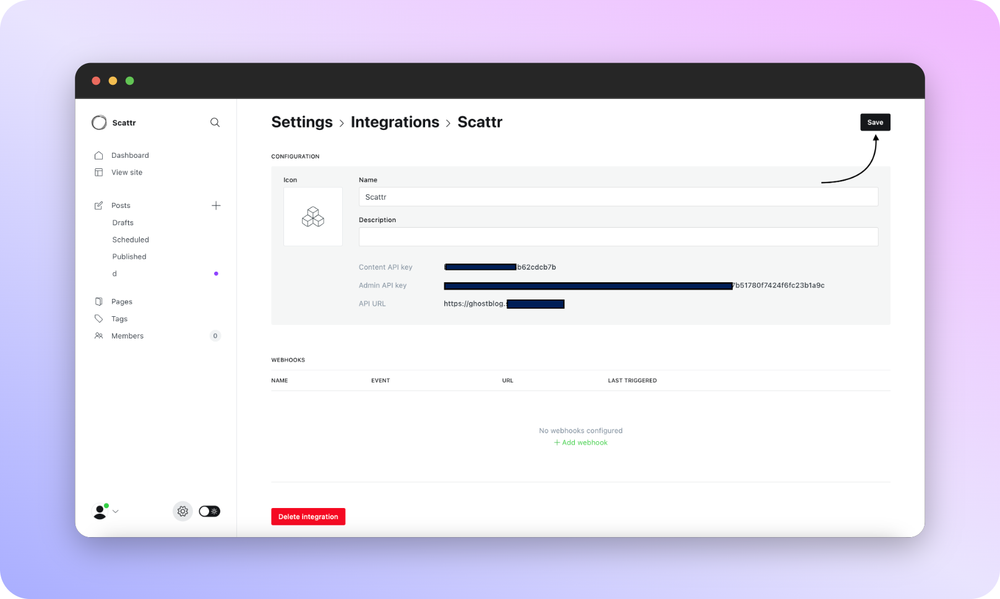

# Ghost

To get your Ghost Admin API key, you'll first need to log into your Ghost blog's admin dashboard. From there, navigate to the "Integrations" section . You should see a section labeled "Integrations" – click on that to access your API key settings.

Click on the "Add custom integration" button to generate your API key.

In the Integrations section, you'll be able to see any existing API keys that have been generated for your blog. To create a new key, click on the "Add Custom Integration" button. This will open a modal window where you can enter a name for your new key.

Once you've entered a name and selected the appropriate access level, click on the "Save" button to generate your new Ghost Admin API key. This key will be displayed on the screen, and it's important to copy it down and store it in a safe place. Keep in mind that this is the only time you'll be able to see your API key – if you lose it, you'll have to generate a new one.

Once you have your Ghost Admin API key, you can use it to access and manage your Ghost blog's data through the Admin API Key. 

Copy the ADMIN API KEY and API URL (scroll to end of page again!) > Paste on scattr integration modal.

That’s it! You now have your Ghost Admin API key and can start using the Ghost with Scattr to access and interact with the content on Ghost.