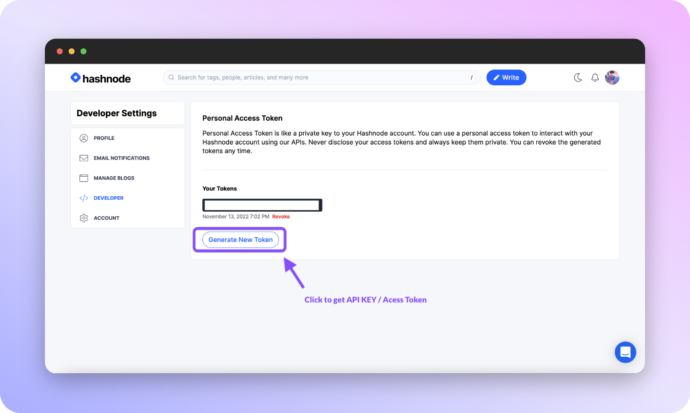
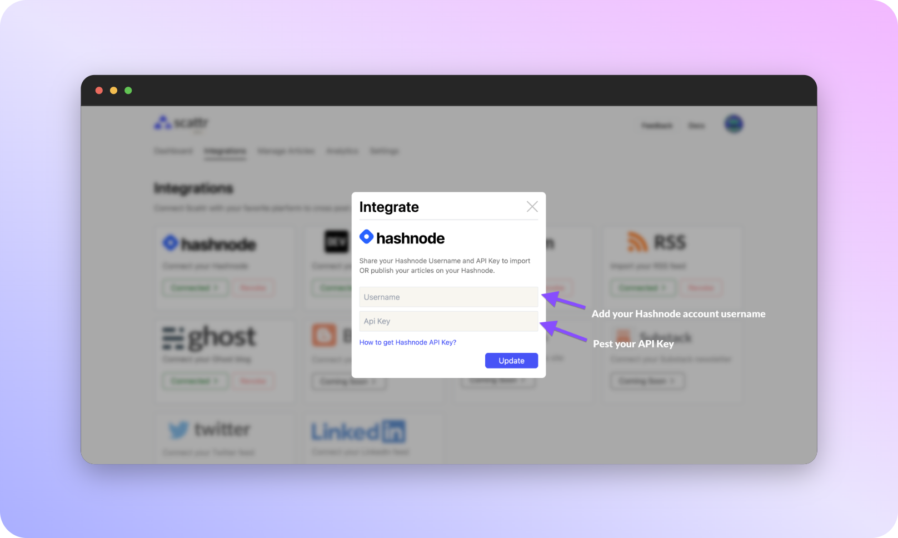

# Hashnode 
    
If you want to integrate the Hashnode with **Scattr**, you will need to obtain an API key. This key will allow you to authenticate your account to the API and ensure that you have permission to access the data you are requesting.

To get started, you will need to have a Hashnode account. If you don't have one already, you can create one by visiting the Hashnode website and clicking on the "**Sign Up**" button. Once you have an account, you can follow these steps to get your API key:

- Log in to your Hashnode account and visit the settings page. You can access this page by clicking on your profile picture in the top-right corner of the screen and selecting "Settings" from the drop-down menu.

- On the developer settings page, scroll down until you see the "API Keys" section. In this section, you will see a button labeled "Generate API Key". Click on this button to generate a new API key for your account.
After clicking on the "Generate API Key" button, a modal window will appear with your API key. Copy this key and save it somewhere safe, as you will need it to access the Hashnode API.

Once you have your API key, pest it in your with hashnode username Scattr account and you are ready to go!

