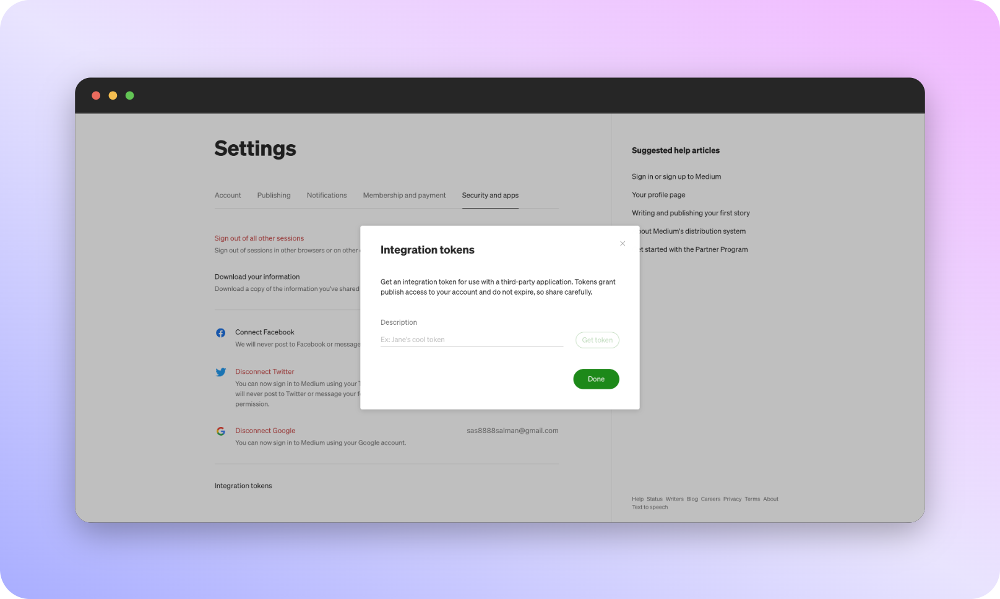

# Medium 

To get your Medium API key, you will need to have a Medium account and be signed in. Once you are logged in, follow these steps:

Go to the [Medium > Settings > Security and apps ](https://medium.com/me/settings/security).

* Click on the “Create integration” button to generate your API key.

* Copy your API key and save it in a secure place. You will need it to access the Medium API in your project.

- Copy the generated code (scroll to end of page again!) > Paste on scattr integration modal.

And that's all it takes, done! 🎊 You have your Medium Account is connected! ❤️

 That’s it! You now have your Medium API key and can start using the Medium with Scattr to access and interact with the content on Medium.

 Keep in mind that your API key is sensitive information and should be kept secure. Do not share it with anyone else or include it in any publicly accessible code or files.

If you ever need to reset or revoke your API key, you can do so from the Medium API developer portal by going to the “My integrations” section and clicking on the “Edit” button for the relevant integration.

