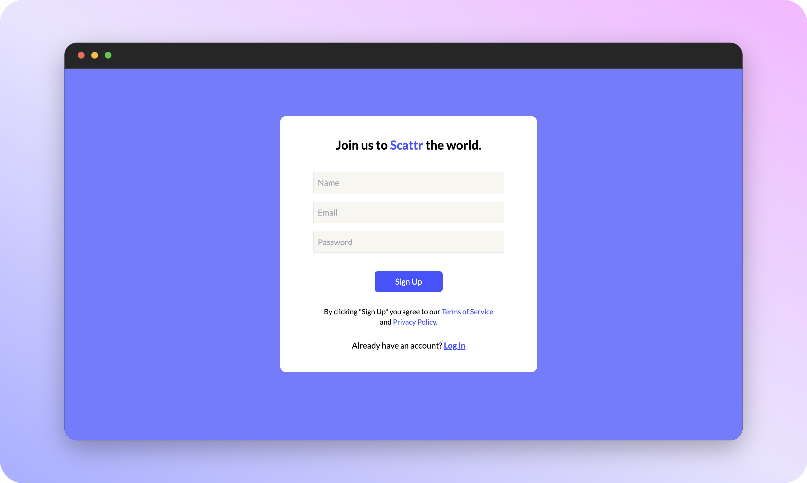
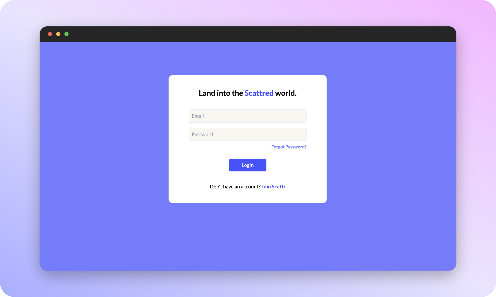

# Onboarding to Scattr
    
To use Scattr, you simply need to have a valid email address. Yes! That's it!

## Signup

Just share your name, email, and set a password, and before you know it, you are on your fresh all new Scattr Dashboard. 😎✨

Sounds crazy right? 
Experience yourself @ [scattr.io/join 🔗](https://scattr.io/join)

## Login

Similar to Signup, just the regular stuff, add email, password, and hit [login](https://www.scattr.io/login)!
And you are all ready to Scattr! ✨

