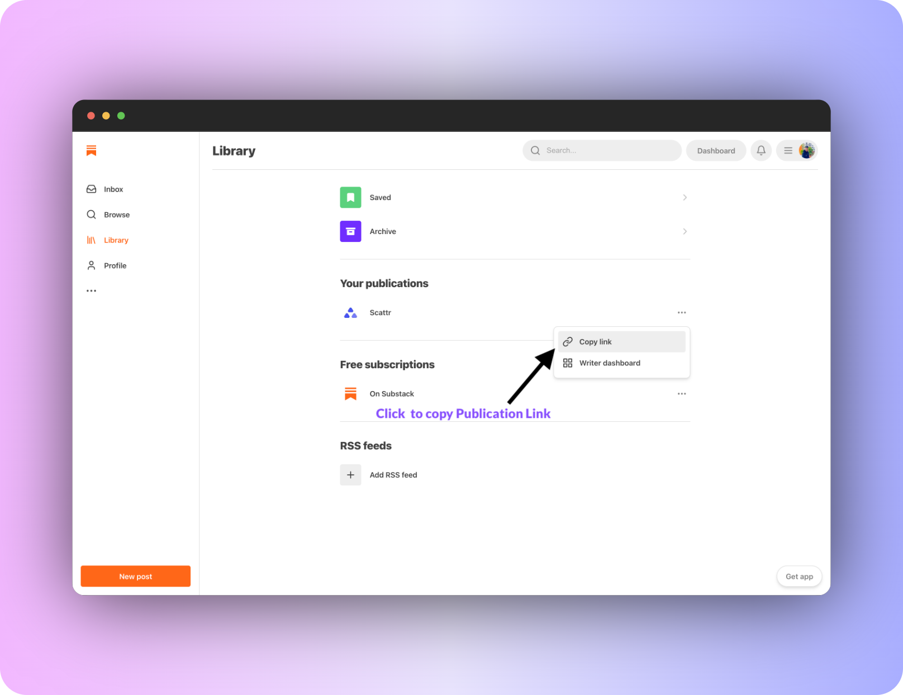
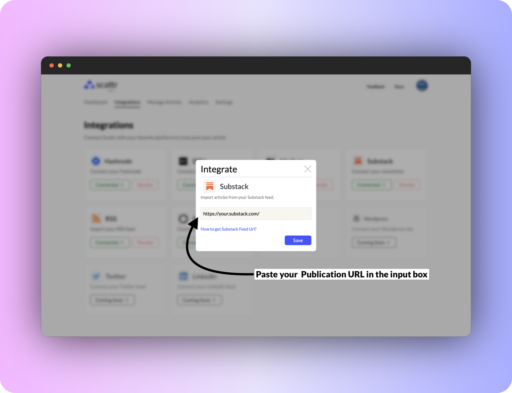

# Substack

Go to the Substack website (https://www.substack.com/).

In the top right corner of the page, click the "Profile" button.

then click on "Library" from the drop-down menu.

and then copy the publication url as given below.

Simply find Substack from the list of cards, and click on it's 'Connect' button.

A modal will pop-up asking your Publication URL - we only need read rights to fetch your articles from the platform.
(and no need to worry we respect privacy ❤️, check our [privacy policy](https://public.scattr.io/Legal-information/Scattr__Privacy_Policy.pdf).

Paste the publication url in the input field and click on the "Save" button.